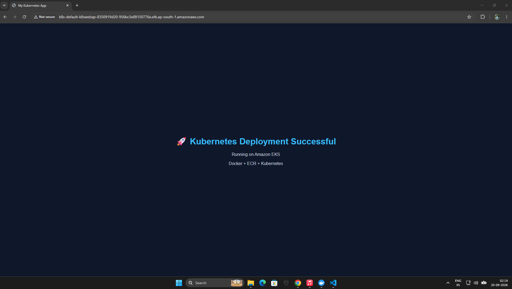

# Kubernetes Web App 🚀

A simple containerized web application deployed on Amazon EKS using Docker, Amazon ECR, and Kubernetes.

## Architecture

Docker → Amazon ECR → Amazon EKS → Kubernetes Service → AWS Network Load Balancer

## Technologies

- Docker
- Amazon ECR
- Amazon EKS
- Kubernetes
- AWS Network Load Balancer
- YAML

## Deployment Screenshot

## Kubernetes Deployment

The application was deployed using:

- Kubernetes Deployment with 2 replicas
- Kubernetes LoadBalancer Service
- Amazon EKS Auto Mode
- AWS Network Load Balancer

## Application

The application displays:

> 🚀 Kubernetes Deployment Successful  
> Running on Amazon EKS  
> Docker + ECR + Kubernetes
